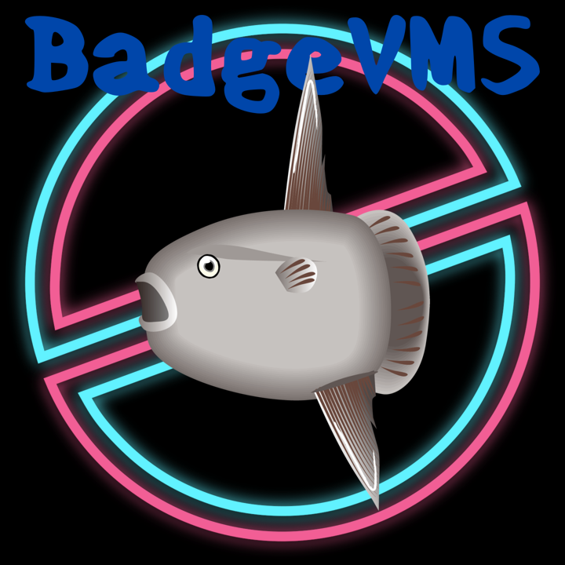

# Welcome to BadgeVMS

BadgeVMS is the most used Badge operating system on the WHY2025 camp.



Some feature highlights:

* Multiple programs can run at once
* Every program gets its own linear address space
* Programs are isolated from each other (but not the operating system)
* VMS like paths and search lists

# Supported hardware

* Why2025 badge (ESP32P4 based)

# Instructions

To build BadgeVMS you need to have esp-idf 5.5 installed. For installation instructions see here: https://docs.espressif.com/projects/esp-idf/en/stable/esp32/get-started/index.html.

Then build and run on the badge with:

```
idf.py build flash monitor
```

_Note: When you do a `git pull` please run an `idf.py fullclean` before rebuilding so changes to sdkconfig.defaults are picked up_

# Example applications

The directory [sdk_apps](sdk_apps) has several small programs in it.

* [framebuffer_test](sdk_apps/framebuffer_test) shows you how to directly interact with the windowing system and keyboard input.
* [sdl_test](sdk_apps/sdl_test) does the same, but for SDL3.
* [sdl2_test](sdk_apps/sdl2_test) does the same, but for SDL2.
* [curl_test](sdk_apps/curl_test) shows you how to do http(s) calls, 
* [thread_test](sdk_apps/thread_test) has a simple example of creating a thread and how to interact with workers.
* And many more!

Finally as a more complete example there is also [doomgeneric](sdk_apps/doomgeneric) a full-fledged doom port! In particular check out [doomgeneric_badgevms.c](sdk_apps/doomgeneric/doomgeneric/doomgeneric_badgevms.c) for examples of framebuffers, scaling, window handling, input, etc.

# Building applications

BadgeVMS has a simple SDK with C, BadgeVMS headers, SDL3, and SDL2. You can build the SDK with

```
idf.py sdk
```

This will generate a directory `sdk_dist` with the headers and libraries.

You then need to use a riscv32 compiler to build for BadgeVMS, one way of doing that is by reusing the `riscv32-esp-elf-*` toolchain that comes with esp-idf, however any riscv32 compiler should work. But only GCC is tested. Example (with esp-idf compilers):

```
riscv32-esp-elf-gcc -O2 -fPIC -fdata-sections -ffunction-sections -flto \
   -fno-builtin -fno-builtin-function -fno-jump-tables -fno-tree-switch-conversion \
   -fstrict-volatile-bitfields -fvisibility=hidden -g3 -mabi=ilp32f \
   -march=rv32imafc_zicsr_zifencei -nostartfiles -nostdlib -shared \
   -Wl,--strip-debug -Wl,--gc-sections -e main --sysroot sdk_dist -isystem sdk_dist/include \
   hello.c -o hello.elf
```

This also works with for instance `riscv64-linux-gnu-gcc` as shipped by Fedora 42.
  
# Linking with the SDK libraries

Due to limitations in the ELF loader in BadgeVMS, do not expose symbols in your program other than `main`, with the default flags above (`-fvisibility=hidden`) this is mostly taken care of, but if linking with an `.a` file, especially one not shipped with the SDK, things might go wrong.
  
In order to link properly with an `.a` file for BadgeVMS please use `-Wl,--exclude-libs,libmylib.a`

# Weird things to keep in mind

 * UNIX paths do not work! Paths are in the form of `DEVICE:[directory.subdirectory]filename.ext`
 * The various GCC options above are not optional. BadgeVMS binaries are position independent ELF shared objects. Other types of binaries will not load.
 * No shared libraries, you there is no `dlopen()` either, all of your dependencies (that is, symbols that come from places other than what is included with the sdk) must be fully statically linked.
